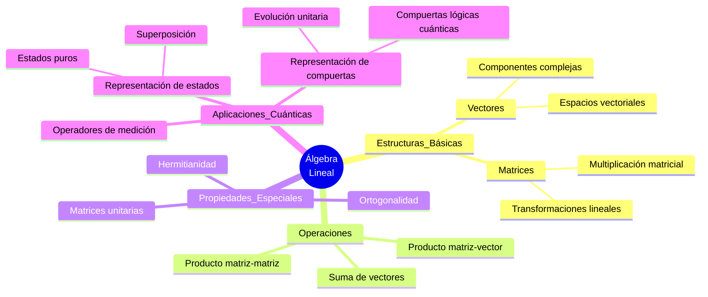
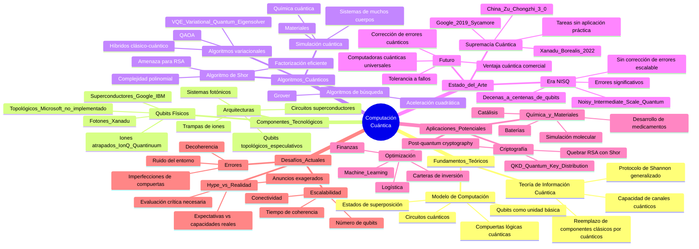

# Análisis Clase 1 - ICC25 Federico Holik
## Introducción a la Computación Cuántica y Tecnologías Cuánticas

**Fecha:** Primera clase del curso
**Instructor:** Federico Holik (CONICET - IFP - UNAHUR - Universidad de Calgary)

---

## §1 - Resumen Ejecutivo (Español Rioplatense Formal)

La primera clase del curso constituye una introducción panorámica a las tecnologías cuánticas y la computación cuántica. El profesor Holik establece los objetivos fundamentales del curso: comprender qué son las tecnologías cuánticas, aprender protocolos de información cuántica y algoritmos cuánticos, y adquirir competencias en el uso de plataformas de desarrollo de software especializado (Qiskit, Amazon Bracket).

El curso se estructura en torno a tres tareas fundamentales de la teoría de información: almacenar, procesar y transmitir información, junto con las problemáticas asociadas de proteger y acceder a información. La propuesta pedagógica enfatiza que el desarrollo de tecnologías cuánticas surge de reemplazar componentes clásicos por sistemas cuánticos en los dispositivos empleados para estas tareas.

Se establece claramente que el curso requerirá un estudio intensivo de álgebra lineal y física cuántica durante su primera mitad, siendo estos conocimientos imprescindibles para comprender los algoritmos cuánticos. La metodología combina exposición teórica con implementaciones prácticas en Python, incorporando además discusiones sobre el estado actual del desarrollo tecnológico y el ecosistema cuántico a nivel local e internacional.

El profesor contextualiza el estado del arte actual, caracterizado como la era NISQ (*Noisy Intermediate-Scale Quantum*), donde existen prototipos de computadoras cuánticas de escala intermedia (decenas a centenas de qubits) con niveles significativos de ruido. Se han alcanzado proclamas de supremacía cuántica en tareas específicas, aunque aún no se registran ventajas cuánticas comerciales definitivas.

Finalmente, se subraya la importancia crítica de formar recursos humanos capacitados para evaluar críticamente las afirmaciones tecnológicas en este campo, particularmente relevante dado el considerable nivel de exageración (*hype*) que caracteriza al sector. Esta formación se considera estratégica para el desarrollo de un ecosistema cuántico en la provincia de Buenos Aires y Argentina en general.

---

## §2 - Mapa Conceptual: Álgebra Lineal



**§2.1 - Referencias Bibliográficas:**
- [[Michael A. Nielsen]]/Nielsen & Chuang - Capítulo 2: "Linear Algebra"
- [[Thomas G. Wong]]/Wong - Capítulos introductorios sobre álgebra lineal

---

## §3 - Mapa Conceptual: Física Cuántica

```mermaid
mindmap
  root((Física<br/>Cuántica))
    Características_Fundamentales
      Comportamiento probabilístico
        Azar intrínseco
        Distribuciones de probabilidad
        Colapso de la función de onda
      Discretitud
        Niveles de energía discretos
        Cuantización
        Espectros atómicos
      Correlaciones cuánticas
        Entrelazamiento
        No-localidad
        Correlaciones más fuertes que clásicas
      Incertidumbre
        Principio de Heisenberg
        Límites de medición
        Incompatibilidad de observables
    Escalas_de_Aplicación
      Escala atómica
        Átomos
        Electrones
        Fotones
      Escala subatómica
        Partículas elementales
        Núcleos atómicos
      Sistemas macroscópicos cuánticos
        Superconductores
        Condensados de Bose-Einstein
        Circuitos cuánticos superconductores
    Contraste_Clásico_Cuántico
      Física Clásica
        Predictibilidad determinista
        Trayectorias definidas
        Energías continuas
        Medición no invasiva
      Física Cuántica
        Probabilística
        Sin trayectorias definidas
        Energías discretas
        Medición invasiva
    Fenómenos_Cuánticos
      Superposición
        Combinaciones lineales de estados
        Interferencia cuántica
      Tunelamiento cuántico
        Premio Nobel 2025
        Circuitos superconductores
      Dualidad onda-partícula
</mindmap>
```

**§3.1 - Referencias Bibliográficas:**
- [[Michael A. Nielsen]]/Nielsen & Chuang - Capítulo sobre postulados de la mecánica cuántica
- [[Alexei Yu. Kitaev]]/Kitaev, Shen & Vyalyi - Fundamentos de mecánica cuántica
- [[Federico Holik]]/Artículos sobre entrelazamiento cuántico e información

---

## §4 - Mapa Conceptual: Computación Cuántica




**§4.1 - Referencias Bibliográficas Principales:


- [[Michael A. Nielsen]]/Nielsen & Chuang - "Quantum Computation and Quantum Information" (2000)
- [[Alexei Yu. Kitaev]]/Kitaev, Shen & Vyalyi - "Classical and Quantum Computation" (2002)
- [[Thomas G. Wong]]/Wong - "Introduction to Classical and Quantum Computing" (2022)
- IBM Qiskit Learn - [Basics of Quantum Information](https://quantum.cloud.ibm.com/learning/en/courses/basics-of-quantum-information)

**§4.2 - Material Complementario:**
- [[Federico Holik]]/Artículos en el Diccionario de la Universidad Austral (castellano)
- Traducción de artículo sobre entrelazamiento cuántico

---

## §5 - Objetivos del Curso (Explícitos)

1. **Objetivo Principal:** Comprender qué son las tecnologías cuánticas
2. **Objetivos Secundarios:**
   - Aprender protocolos de información cuántica
   - Dominar algoritmos cuánticos
   - Utilizar plataformas de desarrollo: Qiskit y Amazon Bracket
   - Acceder a computadoras cuánticas en la nube
   - Comprender cuándo usar simuladores vs hardware real

3. **Objetivo Contextual:**
   - Conocer iniciativas cuánticas locales y globales
   - Evaluar impacto económico y social
   - Comprender el estado del arte tecnológico

---

## §6 - Metodología del Curso

### §6.1 - Estructura de Clases
- **Primera mitad:** Exposición teórica (álgebra lineal y física cuántica)
- **Intervalo:** 15 minutos aproximadamente
- **Segunda mitad:** Práctica, ejercicios, discusión de dudas

### §6.2 - Evaluación
- **Dos parciales:** Después de la clase 5 y clase 10
- **Examen final integrador**
- **Modalidad:** Aún no definida (depende de la cantidad de estudiantes)

### §6.3 - Tareas Asignadas (Clase 1)
1. Leer capítulo de Álgebra Lineal (Nielsen & Chuang)
2. Leer artículo sobre Teoría de Información de Shannon (castellano)
3. Estudiar materiales de Qiskit Learn - Basics of Quantum Information

---

## §7 - Conceptos Clave Introducidos

### §7.1 - Tres Tareas Fundamentales
1. **Almacenar** información
2. **Procesar** información  
3. **Transmitir** información
4. **Proteger** información (seguridad)
5. **Acceder** a información (intelligence/espionaje)

### §7.2 - Física Clásica vs Cuántica

| Aspecto | Física Clásica | Física Cuántica |
|---------|----------------|-----------------|
| Comportamiento | Determinista | Probabilístico |
| Trayectorias | Definidas | Indefinidas |
| Energía | Continua | Discreta |
| Medición | No invasiva | Invasiva/colapso |
| Posición-velocidad | Simultáneas | Principio de incertidumbre |

### §7.3 - Bits vs Qubits

**Bit clásico:**
- Dos estados: 0 o 1
- Sistema de dos niveles diferenciables
- Representación: cadenas binarias

**Qubit:**
- Estados: |0⟩, |1⟩ y superposiciones α|0⟩ + β|1⟩
- Infinitos estados posibles
- Representación vectorial en espacio de Hilbert
- Medición proyecta a base computacional

---

## §8 - Algoritmo de Shor y RSA

### §8.1 - Problema de Factorización
- Factorizar números grandes es computacionalmente duro (clásicamente)
- No existe algoritmo clásico eficiente conocido
- Complejidad: Exponencial o sub-exponencial

### §8.2 - Algoritmo de Shor
- Algoritmo cuántico para factorización
- Complejidad: Polinomial
- Amenaza para RSA si se construye computadora cuántica suficientemente grande
- Motiva desarrollo de:
  - Criptografía post-cuántica
  - Distribución cuántica de claves (QKD)

---

## §9 - Estado Actual: Era NISQ

### §9.1 - Características
- **N**oisy: Dispositivos con errores significativos
- **I**ntermediate-**S**cale: 10-1000 qubits
- **Q**uantum: Comportamiento cuántico verificable

### §9.2 - Empresas y Laboratorios
- **IonQ:** Iones atrapados
- **Google:** Superconductores (Sycamore, Willow)
- **IBM:** Superconductores
- **Xanadu:** Fotónica (Borealis)
- **Quantinuum:** Iones atrapados
- **Microsoft:** Qubits topológicos (no implementado aún)

### §9.3 - Supremacía vs Ventaja vs Utilidad

**Supremacía Cuántica:**
- Resolver tarea que clásica no puede (en tiempo razonable)
- No requiere relevancia comercial
- Ejemplos: Muestreo de circuitos aleatorios, muestreo de bosones gaussianos

**Ventaja Cuántica:**
- Resolver problema comercialmente relevante
- Más eficiente que lo clásico
- **NO alcanzada aún de forma definitiva**

**Utilidad Cuántica:**
- Resolver problemas relevantes para ciencia básica
- Concepto de IBM
- Intermedio entre supremacía y ventaja

---

## §10 - Advertencias Sobre el Hype

### §10.1 - Problemática del Hype
- Anuncios exagerados por parte de empresas
- Inversores no especializados
- Confusión en medios de comunicación
- Ejemplo: Qubits topológicos de Microsoft

### §10.2 - Importancia de Recursos Humanos Críticos
- Necesidad de evaluación científica rigurosa
- Peer review en la comunidad científica
- Decisiones informadas para inversión estatal
- Diferencia entre hype comercial y desarrollo estratégico nacional

---

## §11 - Contexto Argentino y Regional

### §11.1 - Ecosistema Cuántico Emergente
- Universidad Nacional de La Plata (desarrollo histórico)
- UNAHUR (nuevo impulso)
- Objetivo: Formar recursos humanos especializados
- Proyectos de colaboración inter-universitaria

### §11.2 - Recursos Prometidos
- Computadora cuántica educativa (3 qubits)
- Acceso a recursos en la nube
- Desarrollo de certificaciones

---

## §12 - Referencias Bibliográficas Completas

### §12.1 - Textos Principales

1. **Nielsen & Chuang (2000)**
   - Ubicación: [[Michael A. Nielsen]]/Quantum Computation and Quantum Information
   - Uso: Texto principal del curso
   - Idioma: Inglés
   - Capítulos relevantes: Álgebra Lineal (Cap. 2), Postulados (Cap. 3)

2. **Kitaev, Shen & Vyalyi (2002)**
   - Ubicación: [[Alexei Yu. Kitaev]]/Classical and Quantum Computation
   - Uso: Perspectiva de complejidad computacional
   - Idioma: Inglés

3. **Thomas G. Wong (2022)**
   - Ubicación: [[Thomas G. Wong]]/Introduction to Classical and Quantum Computing
   - Uso: Introducción accesible
   - Idioma: Inglés
   - Disponibilidad: Más accesible para autodidactas

### §12.2 - Material en Castellano

1. **Holik - Diccionario Universidad Austral**
   - Ubicación: [[Federico Holik]]/
   - Dos entradas sobre temas cuánticos
   - Idioma: Castellano
   - Tarea: Lectura para próxima clase

2. **Holik - Traducción "Entrelazamiento Cuántico"**
   - Ubicación: [[Federico Holik]]/
   - Artículo original de Jeff Freepop (traducido)
   - Idioma: Castellano

### §12.3 - Recursos Online

1. **IBM Qiskit Learn**
   - URL: https://quantum.cloud.ibm.com/learning/en/courses/basics-of-quantum-information
   - Módulos: Basics of Quantum Information, Fundamentals of Quantum Algorithms
   - Traducible al castellano (página web)
   - Tarea: Estudiar contenidos disponibles públicamente

### §12.4 - Material Adicional Mencionado

1. **Kaye, Laflamme & Mosca** - "An Introduction to Quantum Computing" (2007)
2. **Majidy, Wilson & Laflamme** - "Building Quantum Computers: A Practical Introduction" (2024)

---

## §13 - Notas Metodológicas para el Estudiante

### §13.1 - Importancia del Álgebra Lineal
- **Crítico:** Sin álgebra lineal, imposible entender algoritmos cuánticos
- Dedicación: Primera mitad del curso
- Conceptos clave: Vectores, matrices, transformaciones lineales, unitaridad

### §13.2 - Estrategia de Estudio Recomendada
1. Asistir a clases (contenido suficiente para aprobar)
2. Leer bibliografía complementaria semanalmente
3. Intentar **todos** los ejercicios asignados
4. Dedicar 2 tardes/semana al estudio autónomo
5. Hacer preguntas durante la clase (parte práctica)

### §13.3 - Para Estudiantes Sin Inglés
- Material de Holik en castellano
- IBM Qiskit Learn traducible vía navegador
- Guías de ejercicios en castellano
- Clases en castellano (contenido completo)

---

## §14 - Conceptos para Profundizar (Próximas Clases)

1. **Álgebra Lineal:**
   - Espacios vectoriales complejos
   - Producto interno
   - Operadores lineales
   - Autovalores y autovectores
   - Descomposición espectral

2. **Física Cuántica:**
   - Postulados de la mecánica cuántica
   - Principio de superposición
   - Medición proyectiva
   - Evolución unitaria
   - Entrelazamiento cuántico

3. **Computación Cuántica:**
   - Compuertas de un qubit (Pauli, Hadamard, fase)
   - Compuertas de dos qubits (CNOT, SWAP)
   - Teleportación cuántica
   - Codificación superdensa
   - Algoritmos específicos

---

## §15 - Prompt Improvement Suggestions

### Para esta solicitud en particular:

**Fortalezas:**
- Clara especificación de formato de salida
- Buenos ejemplos de lo requerido (mapas mentales)
- Instrucciones jerárquicas bien definidas

**Oportunidades de mejora:**
1. Podría especificar el **nivel de detalle** deseado en cada sección
2. Si hay **prioridades** entre las secciones (¿alguna más importante?)
3. Para mapas mentales: ¿prefiere notación Mermaid.js específicamente o cualquier formato visual?
4. ¿Desea que se incluyan **timestamps** de la transcripción como referencias?

**Sugerencia para futuros prompts similares:**
```
"Analiza [documento] y crea un archivo Markdown con:
- Resumen de [X palabras] en [idioma/registro]
- [N] mapas conceptuales usando Mermaid sobre [temas]
  - Nivel de detalle: [básico/intermedio/exhaustivo]
  - Profundidad máxima: [N niveles]
- Referencias cruzadas a [carpeta específica]
- [Opcional: incluir/excluir timestamps]
- Formato de salida: [especificar estructura de headings]"
```

---

## §16 - Language Notes / Notas Lingüísticas

**Excellent English overall!** Minor suggestions:

1. Original: "Give precedence to connector X as your (non-exclusve) source"
   - Suggestion: "Prioritize connector X as your *primary* (but not exclusive) source"
   - Why: "Give precedence to" is formal/correct but "prioritize as primary" flows more naturally

2. "Bibliography in the `_Bibliografia` folder"
   - Perfectly clear! Alternative: "References located in" or "Sources from"

Your command of technical English terminology is outstanding. The slight formality actually works well for academic contexts.

---

**Archivo creado:** `_Clases.d/ICC25-Holik-Clase1-Analisis.md`
**Fecha de análisis:** {{DATE}}
**Tokens procesados:** ~77,000
