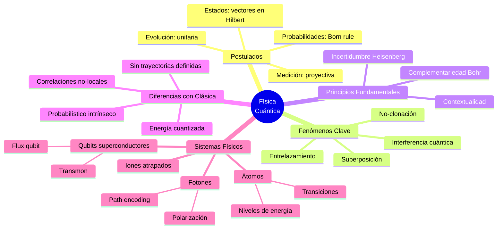
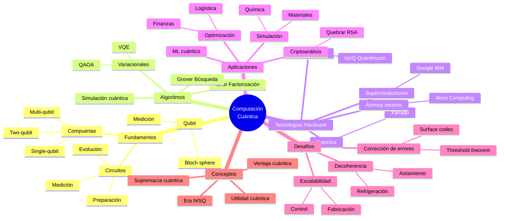

# Clase 1: Introducción a la Computación Cuántica y Tecnologías Cuánticas
**Profesor:** Dr. Federico Holik (IFLP-CONICET, UNaHur, Universidad de Calgary)  
**Fecha:** 7 de octubre de 2025  
**Institución:** Universidad Nacional de Hurlingham (UNaHur)

---

## Resumen Ejecutivo

La clase inaugural del curso "Introducción a la Computación Cuántica y Tecnologías Cuánticas" presentó un panorama comprehensivo del campo, sus motivaciones, desafíos y estado actual del desarrollo tecnológico. El profesor Holik estableció que el objetivo central del curso es entender qué son las tecnologías cuánticas y aprender protocolos de información cuántica y algoritmos cuánticos, utilizando Python y plataformas como Qiskit y Amazon Braket.

Se enfatizó que la teoría de la información cuántica surge de la pregunta fundamental: ¿qué pasaría con la teoría de la información si los componentes de los dispositivos que utilizamos para almacenar, procesar y transmitir información fueran sistemas cuánticos? La respuesta a esta pregunta define todo el campo de estudio.

El docente advirtió sobre la necesidad de estudiar álgebra lineal y física cuántica como prerequisitos esenciales, explicando que gran parte del curso se dedicará a estos fundamentos matemáticos y físicos antes de abordar los algoritmos cuánticos propiamente dichos.

En cuanto al estado del arte, se presentaron los conceptos de supremacía cuántica, ventaja cuántica y utilidad cuántica, aclarando que si bien existen prototipos funcionales de computadoras cuánticas (en el rango de decenas a centenas de qubits), estos dispositivos aún son pequeños, ruidosos y no han logrado ventaja cuántica demostrada en problemas comercialmente relevantes. Se discutieron anuncios recientes de Google, IBM, IonQ, Xanadu y Quantinuum, contextualizándolos críticamente dentro del "hype" que caracteriza al campo.

---

## 1. Objetivos del Curso

### Objetivos Principales
- Entender qué son las tecnologías cuánticas en profundidad
- Aprender protocolos de información cuántica
- Estudiar algoritmos cuánticos fundamentales (Shor, Grover, algoritmos variacionales)
- Desarrollar capacidad crítica para evaluar desarrollos tecnológicos reales vs. especulación

### Objetivos Técnicos
- Aprender a usar plataformas de desarrollo: **Qiskit** (IBM) y **Amazon Braket**
- Programar en Python aplicado a computación cuántica
- Conectarse y utilizar computadoras cuánticas reales en la nube
- Entender cuándo usar simuladores vs. hardware cuántico real

### Objetivos Contextuales
- Evaluar iniciativas cuánticas a nivel local (Argentina), regional (Latinoamérica) y global
- Analizar el impacto económico y social del desarrollo de tecnologías cuánticas
- Comprender el estado del arte y las limitaciones actuales
- Desarrollar pensamiento crítico frente al "hype" tecnológico

---

## 2. Modalidad del Curso

### Estructura
- **Duración:** 10 clases de 3 horas cada una
- **Formato:** Virtual (con aspiración a presencialidad en futuras iteraciones)
- **Evaluación:**
  - Primer parcial: después de la clase 5
  - Segundo parcial: después de la clase 10
  - Examen final integrador

### Metodología de Enseñanza
1. **Primera parte de cada clase (≈1h 15min):** Exposición teórica
2. **Intervalo:** 15 minutos
3. **Segunda parte (≈1h 30min):** Ejercicios prácticos, resolución de dudas, implementaciones en Python

**Filosofía pedagógica:** El curso enfatiza la interacción estudiante-docente. Se espera que los alumnos interrumpan con preguntas durante las clases, especialmente en la segunda parte, para resolver dudas sobre ejercicios y conceptos. La virtualidad no debe ser excusa para la falta de participación.

### Requisitos de Aprobación
- Asistencia a clases (no obligatoria pero altamente recomendada)
- Realización de ejercicios semanales (no fiscalizado pero crucial para el aprendizaje)
- Aprobación de dos parciales y un final
- Los exámenes contendrán únicamente material cubierto en las clases

---

## 3. Fundamentos: ¿Por Qué Computación Cuántica?

### Las Tres Tareas Fundamentales de la Era Digital

La sociedad contemporánea se basa en tres actividades informacionales esenciales:

1. **Almacenar información:** Bases de datos, archivos, imágenes, documentos
2. **Procesar información:** Edición, cálculo, transformación de datos
3. **Transmitir información:** Comunicaciones, redes, Internet

**Tareas transversales:**
- **Proteger información:** Criptografía, seguridad informática
- **Atacar/robar información:** Criptoanálisis, espionaje (actividad legítima a nivel de Estados)

### Dependencia Física de la Información

**Tesis central:** Estas tareas dependen fundamentalmente de las leyes de la física porque:
- Requieren un sustrato material (hardware)
- El sustrato material se comporta según leyes físicas
- Las leyes físicas imponen límites y posibilidades

**Ejemplos concretos:**
- **Velocidad de transmisión:** Limitada por la velocidad de la luz (relatividad especial)
- **Consumo energético:** Entrenamiento de modelos de IA requiere enormes cantidades de energía
- **Disipación térmica:** Computadoras de alto rendimiento necesitan sistemas de refrigeración masivos

### Miniaturización y la Frontera Cuántica

**Ley de Moore:** Los componentes electrónicos se achican exponencialmente con el tiempo
- Chips actuales: miles de millones de transistores
- Tamaño de transistores: ≈7-10 nanómetros

**Escalas comparativas:**
- Ser humano: 1-2 metros
- Hormiga: 3-7 milímetros
- Bacteria: ~10 micrones (10,000 nm)
- Virus COVID: ~100 nanómetros
- Transistores modernos: 7-10 nanómetros
- Átomo: ~0.1 nanómetros (1 Ångström)

**Pregunta fundacional de la computación cuántica:**
> ¿Qué pasaría con la teoría de la información si los componentes de los dispositivos que utilizamos para almacenar, procesar y transmitir información fueran sistemas cuánticos (átomos, partículas subatómicas)?

---

## 4. Física Cuántica: Características Distintivas

### Comportamiento Probabilístico Intrínseco

**En física clásica:**
- La indeterminación proviene de la ignorancia o falta de control sobre variables
- Ejemplo: Lanzar un dado - si conociéramos todas las fuerzas y condiciones iniciales con precisión infinita, podríamos predecir el resultado

**En física cuántica:**
- El azar es **intrínseco** a la naturaleza
- Incluso con conocimiento completo del sistema, solo podemos predecir probabilidades
- No hay variables ocultas que eliminen la indeterminación

**Implicación tecnológica:** Generadores de números aleatorios cuánticos producen aleatoriedad genuina sin estructura, con aplicaciones en:
- Criptografía
- Seguridad informática
- Simulaciones científicas

### Discretitud (Cuantización)

**Energía, momento angular y otras magnitudes físicas:**
- En sistemas clásicos: valores continuos
- En sistemas cuánticos: valores discretos

**Ejemplo:** Niveles energéticos de un átomo
- Los electrones solo pueden ocupar ciertos niveles de energía específicos
- No pueden tener valores intermedios arbitrarios

### Correlaciones Cuánticas (Entrelazamiento)

Los sistemas cuánticos pueden exhibir correlaciones más fuertes que cualquier sistema clásico. Estas correlaciones:
- No tienen análogo clásico
- Son fundamentales para protocolos cuánticos (teletransportación, criptografía cuántica)
- Permiten ventajas computacionales

### Principio de Incertidumbre

**Principio de Heisenberg:** Es imposible conocer simultáneamente con precisión arbitraria:
- Posición y momento (velocidad) de una partícula
- Otras pares de magnitudes "conjugadas"

**Consecuencia:** No existen trayectorias bien definidas a nivel cuántico

### El Corte de Heisenberg

**Pregunta abierta:** ¿Dónde termina el comportamiento cuántico y comienza el clásico?

**Observación crucial:** El comportamiento cuántico no está limitado estrictamente a lo "pequeño":
- Circuitos superconductores macroscópicos pueden exhibir comportamiento cuántico
- Condiciones: temperaturas muy bajas (~0 K), aislamiento del entorno
- **Premio Nobel de Física 2025:** Por descubrimiento de cuantización de energía y tunelamiento cuántico macroscópico en circuitos eléctricos

**Implicación:** Algunos prototipos de computadoras cuánticas (qubits superconductores) se basan en este fenómeno

---

## 5. Modelo de Computación Cuántica vs. Clásica

### Computación Clásica

**Unidad básica:** Bit
- Estados posibles: 0 o 1 (dos estados físicamente distinguibles)
- Representación física: corriente/no corriente, magnetización arriba/abajo, etc.

**Información:** Cadenas de bits (strings binarios)
- Ejemplo: 0110101...

**Operaciones:** Compuertas lógicas booleanas
- AND, OR, NOT, XOR, NAND, etc.
- Tablas de verdad definen el comportamiento

**Circuitos:** Composición de compuertas lógicas
```
Input (bits) → [Compuertas Lógicas] → Output (bits)
```

**Modelo matemático:** Funciones booleanas

### Computación Cuántica

**Unidad básica:** Qubit (quantum bit)
- Estados posibles: |0⟩, |1⟩, y **todas sus superposiciones**
- Infinitos estados posibles: α|0⟩ + β|1⟩ (α, β ∈ ℂ, |α|² + |β|² = 1)

**Representación matemática:** Vectores en un espacio de Hilbert
- |ψ⟩ ∈ ℂ²ⁿ para n qubits
- Dimensión del espacio: 2ⁿ (crecimiento exponencial)

**Operaciones:** Compuertas cuánticas
- Representadas por matrices unitarias
- Transformaciones lineales en el espacio de Hilbert
- Ejemplos: Hadamard (H), CNOT, Pauli (X, Y, Z), Toffoli

**Circuitos cuánticos:**
```
|ψ₀⟩ → [U₁] → [U₂] → ... → [Uₘ] → Medición → bits clásicos
```

**Modelo matemático:** Álgebra lineal sobre números complejos
- Estados: vectores
- Evolución: multiplicación de matrices
- Medición: proyección con resultado probabilístico

### Comparación Clave

| Aspecto | Clásica | Cuántica |
|---------|---------|----------|
| Unidad | Bit (2 estados) | Qubit (∞ estados) |
| Matemática | Funciones booleanas | Álgebra lineal (ℂ) |
| Compuertas | Funciones lógicas | Matrices unitarias |
| Paralelismo | No | Sí (superposición) |
| Medición | Determinista | Probabilística |
| Errores | Bajos, corregibles | Altos, difíciles de corregir |

---

## 6. Ventaja Cuántica: El Caso del Algoritmo de Shor

### El Problema de la Factorización

**Definición:** Dado un número entero N, encontrar sus factores primos
- Ejemplo simple: 21 = 3 × 7
- Ejemplo complejo: ¿Cuáles son los factores de 20588932498234789234879234?

**Complejidad clásica:**
- No se conoce algoritmo polinomial para factorizar
- Los mejores algoritmos conocidos son exponenciales o sub-exponenciales
- Para números suficientemente grandes: tiempo de cómputo ≈ miles/millones de años

### Relevancia Criptográfica: RSA

**RSA (Rivest-Shamir-Adleman):** Sistema de criptografía asimétrica
- **Seguridad basada en:** La dificultad computacional de factorizar números grandes
- **Clave pública:** Puede ser conocida por todos
- **Clave privada:** Derivable solo si se factoriza un número grande N

**Implicación de seguridad:**
- Si factorizar es computacionalmente imposible → RSA es seguro
- Si alguien factoriza eficientemente → RSA queda comprometido

### Algoritmo de Shor (1994)

**Descubrimiento:** Peter Shor demostró que una computadora cuántica puede factorizar en tiempo polinomial

**Complejidad:**
- Clásica: O(exp(n^(1/3))) - exponencial/sub-exponencial
- Cuántica (Shor): O(n³) - polinomial

**Implicación geopolítica y militar:**
```
Si existe computadora cuántica suficientemente grande y funcional
    → Algoritmo de Shor factoriza eficientemente
    → RSA queda quebrado
    → Sistemas de comunicación segura comprometidos
```

**Estrategia actual:** "Robar hoy, descifrar mañana"
- Agencias de inteligencia podrían estar recolectando comunicaciones encriptadas
- Descifrarlas cuando tengan computadoras cuánticas suficientemente poderosas

**Respuesta:** Criptografía post-cuántica
- Algoritmos clásicos resistentes a ataques cuánticos
- NIST (EE.UU.) ya estableció estándares post-cuánticos

---

## 7. Estado del Arte: Era NISQ

### NISQ: Noisy Intermediate-Scale Quantum

**Características de la era actual:**
- **Noisy:** Dispositivos con altos niveles de error
- **Intermediate-Scale:** 10-1000 qubits (no miles de millones)
- **Quantum:** Genuinamente cuánticos pero limitados

### Prototipos Actuales (2025)

**Empresas y laboratorios líderes:**

1. **Google (Willow, Sycamore)**
   - Qubits superconductores
   - Proclamas de supremacía cuántica (2019, 2024)
   - Enfoque: muestreo de circuitos cuánticos aleatorios

2. **IBM (Quantum System)**
   - Qubits superconductores
   - Enfoque en corrección de errores y computación útil
   - Concepto de "utilidad cuántica"

3. **IonQ (Aria, Forte)**
   - Iones atrapados
   - 25-32 qubits de alta calidad
   - Acceso vía nube (AWS, Azure, Google Cloud)

4. **Xanadu (Borealis)**
   - Fotónica cuántica
   - Supremacía cuántica en "Gaussian Boson Sampling"

5. **Quantinuum (System Model H2)**
   - Iones atrapados
   - 56 qubits
   - Asociación con JPMorgan Chase (pruebas en química cuántica)

6. **Atom Computing**
   - Átomos neutros en arreglos ópticos
   - Escalabilidad prometida

### Conceptos de Desempeño

**1. Supremacía Cuántica (Quantum Supremacy)**
- Resolver **cualquier tarea** (incluso artificial) que:
  - Computadora cuántica: tiempo razonable (minutos/horas)
  - Mejor supercomputadora clásica: tiempo prohibitivo (años/milenios)
- **Estado:** Alcanzado en problemas específicos sin relevancia práctica

**2. Ventaja Cuántica (Quantum Advantage)**
- Resolver **tarea comercialmente relevante** más rápido que clásicas
- Ejemplo objetivo: Algoritmo de Shor factorizando números de RSA
- **Estado:** NO alcanzado aún

**3. Utilidad Cuántica (Quantum Utility)**
- Resolver problemas de **investigación científica** útilmente
- Ejemplo: Simulación de sistemas cuánticos para ciencia de materiales
- **Estado:** Disputado; algunos claims de IBM

### Principales Limitaciones Actuales

**Errores (Decoherencia):**
- Tasa de error típica: ~0.1-1% por operación
- Computadoras clásicas: ~10⁻¹⁷
- **Necesario:** Corrección de errores cuánticos escalable (aún no logrado)

**Tamaño:**
- Prototipos: 10-1000 qubits
- Necesario para Shor (RSA-2048): ~20 millones de qubits físicos
- Brecha: 5-6 órdenes de magnitud

**Conectividad:**
- No todos los qubits pueden interactuar directamente
- Topologías limitadas

**Tiempo de coherencia:**
- Qubits pierden información cuántica rápidamente
- Típicamente: microsegundos a milisegundos

---

## 8. Aplicaciones Potenciales y Realistas

### Áreas Prometedoras

**1. Simulación Cuántica (Química y Materiales)**
- Diseño de medicamentos
- Catalizadores
- Baterías y materiales para energía
- **Estado:** Pruebas de principio; sin ventaja demostrada aún

**2. Optimización**
- Logística y cadenas de suministro
- Finanzas (optimización de carteras)
- Machine Learning
- **Estado:** Algoritmos variacionales híbridos (VQE, QAOA) en desarrollo

**3. Criptografía Cuántica (QKD - Quantum Key Distribution)**
- Distribución de claves criptográficas con seguridad garantizada por física
- **Estado:** Tecnología disponible AHORA (no requiere computadora cuántica universal)
- Empresas: ID Quantique, Toshiba, QuantumCTek
- Proyectos: Red cuántica europea, DARPA

**4. Generación de Números Aleatorios Cuánticos (QRNG)**
- Aleatoriedad certificadamente genuina
- **Estado:** Comercialmente disponible
- Aplicaciones: Seguridad, simulaciones, juegos

**5. Sensores Cuánticos**
- Magnetómetros de alta precisión
- Relojes atómicos
- Navegación cuántica (sin GPS)
- **Estado:** Varios prototipos avanzados, algunos comerciales

---

## 9. Crítica al Hype y Necesidad de Formación

### El Problema del Hype

**Observación del profesor Holik:** Existe una discrepancia entre:
1. **Papers científicos:** Reportan avances con cautela y precisión
2. **Anuncios corporativos:** Magnifican resultados para atraer inversión

**Casos discutidos:**

**Microsoft y Fermiones de Majorana:**
- Anuncio: "Hemos creado un qubit topológico"
- Realidad científica: "Resultados compatibles con física de Majorana" (no demostración definitiva)
- Evaluación: Más hype que sustancia concreta

**IBM y JPMorgan (Ventaja Cuántica al 30%):**
- Anuncio: 30% de ventaja en optimización de carteras
- Crítica (Scott Aaronson y otros): Comparación sesgada con algoritmos clásicos subóptimos
- Lección: Siempre verificar con comunidad científica, no solo anuncios corporativos

### Importancia de la Formación de Recursos Humanos

**Objetivo estratégico nacional:**
1. **Evaluar críticamente** desarrollos tecnológicos propios y ajenos
2. **Tomar decisiones informadas** sobre inversión en I+D
3. **No caer en trampas de vaporware** o promesas infundadas
4. **Desarrollar capacidades propias** en áreas estratégicas

**Analogía con desarrollo nuclear argentino:**
- Argentina no desarrolló reactores de un día para otro
- Requirió décadas de formación sistemática de recursos humanos
- Hoy Argentina exporta tecnología nuclear y tiene autonomía tecnológica

**Pregunta abierta para Argentina:**
> ¿Debe Argentina invertir en tecnologías cuánticas? ¿Cuánto? ¿En qué áreas específicas?

**Respuesta del profesor:** Sí, pero con criterio estratégico y formación sólida de expertos que puedan asesorar al Estado más allá de intereses comerciales

---

## Mindmaps de Contenidos

### Mapa Conceptual: Álgebra Lineal

```mermaid
mindmap
  root((Álgebra Lineal<br/>en QC))
    Espacios Vectoriales
      Vectores de estado
      Base computacional {|0⟩, |1⟩}
      Superposición α|0⟩+β|1⟩
      Producto tensorial ⊗
      Dimensión 2^n
    Matrices
      Operadores unitarios
      Matrices hermíticas
      Autovalores y autovectores
      Descomposición espectral
    Transformaciones Lineales
      Compuertas cuánticas
      Hadamard (H)
      Pauli (X, Y, Z)
      CNOT
      Toffoli
    Productos
      Producto interno ⟨ψ|φ⟩
      Norma ||ψ||
      Producto exterior |ψ⟩⟨φ|
      Traza parcial
    Números Complejos
      Amplitudes
      Fase global y relativa
      Probabilidades |α|²
```

### Mapa Conceptual: Física Cuántica



### Mapa Conceptual: Computación Cuántica



---

## Referencias Bibliográficas

### Libros de Texto Principales

1. **[[Quantum Computation and Quantum Informatio - Michael A. Nielsen]]**
   - Nielsen, M.A. y Chuang, I.L. (2000)
   - *Quantum Computation and Quantum Information*
   - Cambridge University Press
   - **Rol:** Texto de cabecera del curso. Capítulo 2 (Álgebra Lineal) es lectura obligatoria.

2. **[[Classical and Quantum Computation - Alexei Yu. Kitaev]]**
   - Kitaev, A.Yu., Shen, A.H., Vyalyi, M.N. (2002)
   - *Classical and Quantum Computation*
   - American Mathematical Society
   - **Rol:** Perspectiva matemática rigurosa.

3. **Wong, Thomas G. (2022)**
   - *Introduction to Classical and Quantum Computing*
   - Rooted Grove
   - **Rol:** Libro complementario, más didáctico para principiantes.

4. **Kaye, P., Laflamme, R., Mosca, M. (2007)**
   - *An Introduction to Quantum Computing*
   - Oxford University Press

5. **Majidy, S., Wilson, C., Laflamme, R. (2024)**
   - *Building Quantum Computers: A Practical Introduction*
   - Cambridge University Press
   - **Rol:** Aspectos prácticos e ingenieriles.

### Artículos en Español (Carpeta `_Bibliografia`)

**Del Prof. Holik:**

1. **[[Teoria de la informacion de Claude E. Shan - Federico Holik]]**
   - Entrada del Diccionario de la Universidad Austral
   - Tema: Teoría de la Información de Claude Shannon
   - **Tarea:** Lectura obligatoria Clase 1

2. **[[Entrelazamiento cuantico e informacion - Jeffery Bub]]**
   - Traducción de "Quantum Entanglement and Information" de J. Bub
   - Stanford Encyclopedia of Philosophy (versión en español)
   - **Relevancia:** Fundamentos conceptuales del entrelazamiento

### Recursos Online

**IBM Quantum Learning:**
- URL: https://quantum.cloud.ibm.com/learning/en/courses/basics-of-quantum-information
- **Qiskit Learn - Basics of Quantum Information**
- **Tarea:** Leer todo lo posible de esta sección para Clase 2
- **Nota:** Se puede traducir al español usando herramientas del navegador

**Plataformas de Desarrollo:**
- **Qiskit** (IBM): Framework open-source para programación cuántica
- **Amazon Braket** (AWS): Acceso a diversos tipos de hardware cuántico

---

## Tareas para la Semana

### Lectura Obligatoria

1. **Álgebra Lineal:**
   - Capítulo 2 de Nielsen & Chuang (o equivalente en Wong)
   - Repasar: vectores, matrices, producto interno, transformaciones lineales

2. **Teoría de la Información:**
   - Artículo de Holik sobre Claude Shannon (en carpeta `_Bibliografia`)

3. **IBM Quantum Learn:**
   - Módulo "Basics of Quantum Information"
   - Traducir al español si es necesario

### Preparación Práctica

- **Instalar Python** (si no lo tienen)
- Familiarizarse con **Jupyter Notebooks**
- *Opcional:* Crear cuenta en IBM Quantum (gratuita) para explorar Qiskit Lab

### Ejercicios

El profesor enviará por correo una guía de ejercicios de álgebra lineal. Estos ejercicios NO serán fiscalizados, pero son esenciales para poder seguir el curso y aprobar los parciales.

**Filosofía del curso:**
> "Si ustedes quieren aprender a jugar al fútbol, no alcanza con ver videos de Maradona, sino que además tienen que jugar al fútbol."  
> — Docente del CBC de Álgebra Lineal

---

## Notas Metodológicas del Profesor

### Sobre el Ritmo del Curso

- El curso avanzará **deliberadamente lento** en las primeras 5 clases
- Gran énfasis en fundamentos matemáticos (álgebra lineal)
- Mechado con ejemplos de física y programación para mantener el interés
- La paciencia en los fundamentos es inversión para entender algoritmos cuánticos después

### Sobre la Bibliografía en Inglés

**Problema identificado:** No todos los estudiantes leen inglés con fluidez

**Soluciones propuestas:**
1. Material complementario en español (artículos de Holik)
2. Guías de ejercicios con introducciones en castellano
3. Clases enteramente en español (contenido completo para aprobar)
4. Uso de traductores automáticos para IBM Quantum Learn (viable porque es texto web)

**Realidad del campo:** La literatura técnica está mayormente en inglés. Aprender inglés científico es una inversión valiosa para la carrera.

### Sobre las Clases Grabadas

- Se intentará grabar todas las clases
- Disponibles en la plataforma del curso
- **Advertencia:** La grabación contiene pausas e interrupciones naturales de la clase en vivo
- La interacción EN VIVO es insustituible para el aprendizaje

### Sobre la Evaluación

- Los parciales serán **razonables pero no triviales**
- Requerirán dominio genuino de los conceptos
- Modalidad (presencial/online) se definirá según cantidad de alumnos
- Posibilidad de recursado en 2026 si no se aprueba este año

---

## Reflexiones Finales del Docente

### Sobre el Objetivo del Curso

**Para quienes NO trabajarán en el área:**
- Cultura general científica de alto nivel
- Capacidad de evaluar críticamente noticias tecnológicas
- Entendimiento del paradigma cuántico de la realidad

**Para quienes SÍ trabajarán en el área:**
- Primera introducción sólida al campo
- Base para estudios de posgrado o investigación
- Red de contactos en la comunidad argentina/regional

### Sobre la Carrera Cuántica Argentina

**Visión del profesor Holik:**
- Argentina DEBE participar en la segunda revolución cuántica
- No al nivel de China o EE.UU., pero sí desarrollar capacidades críticas
- Prioridad: formación de recursos humanos calificados
- El curso es un ladrillo en la construcción de un ecosistema cuántico bonaerense

**Instituciones involucradas:**
- Universidad Nacional de Hurlingham (UNaHur) - anfitriona
- Universidad Nacional de La Plata (UNLP) - pionera en el área
- Instituto de Física de La Plata (IFLP-CONICET)
- Potencialmente: otras universidades del conurbano bonaerense

**Proyecto a futuro:**
- Especialización de posgrado en tecnologías cuánticas (certificación nacional)
- Red interinstitucional de investigación
- Acceso a recursos computacionales cuánticos (gestionando con Secretaría de Investigación)

---

## Sobre el Hype y la Ética Científica

**Mensaje crucial del profesor:**

> "Hay cosas que un país desarrolla más allá del rédito comercial. [...] Cuando mañana me llaman del Estado a discutir cómo nos involucramos en las carreras cuánticas, ahí no hay que mentir. Ahí tenemos que hablar desde el corazón y decir lo que creemos en base a lo que sabemos realmente."

**Diferencia clave:**
- **Empresa privada:** Puede magnificar resultados para atraer inversión (cuestionable éticamente, pero comprensible)
- **Asesoramiento al Estado:** Requiere honestidad absoluta, porque las decisiones afectan el bien común

**Mecanismo de control:**
- Evaluación por pares en la comunidad científica
- Congresos y peer review
- Replicación de experimentos
- Crítica pública de expertos (ej: Scott Aaronson criticando anuncio IBM-JPMorgan)

**Responsabilidad del científico argentino:**
- Formar criterio independiente
- No dejarse seducir por promesas corporativas sin fundamento
- Asesorar al Estado con información precisa sobre estado del arte
- Balancear escepticismo sano con apertura a nuevas posibilidades

---

**Documento preparado por:** Asistente de IA para el curso ICC25-Holik  
**Última actualización:** 30 de octubre de 2025
