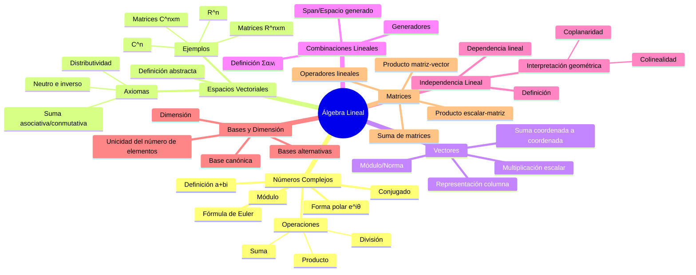

# Clase 2 - Formalismo Cuántico y Álgebra Lineal

**Fecha:** Martes 29 de octubre, 2024  
**Docente:** Federico Holik  
**Curso:** Introducción a la Computación Cuántica 2025

**Clase anterior:** [[ICC25-Holik-Clase1_Resumen|Clase 1 - Introducción General]]  
**Clase siguiente:** Clase 3 - Producto Interno y Notación de Dirac

---

## Resumen Ejecutivo

La segunda clase del curso constituye una introducción fundamental al formalismo matemático de la mecánica cuántica, con énfasis particular en la teoría de espacios vectoriales complejos. Se inició la sesión motivando la necesidad del álgebra lineal mediante el experimento de la doble rendija, ilustrando el comportamiento contraintuitivo de los sistemas cuánticos y la emergencia de patrones de interferencia. Posteriormente, se desarrolló sistemáticamente la teoría de espacios vectoriales, comenzando con espacios reales (ℝⁿ) para luego extender los conceptos a espacios complejos (ℂⁿ), que constituyen el marco matemático apropiado para la descripción de estados cuánticos.

Se enfatizó la distinción crucial entre la física clásica determinista y la física cuántica probabilística, estableciendo que en mecánica cuántica no existe el concepto de trayectoria, sino que se trabaja con distribuciones de probabilidad que dependen del contexto experimental. La clase concluyó con una discusión sobre la naturaleza de la probabilidad y su interpretación frecuentista, preparando el terreno para la comprensión de las amplitudes de probabilidad cuánticas.

**Conexión con Clase 1:** Esta clase profundiza los conceptos presentados en la [[ICC25-Holik-Clase1_Resumen#Conceptos Básicos de Mecánica Cuántica|introducción a la mecánica cuántica]], proporcionando el formalismo matemático necesario para describir los fenómenos cuánticos discutidos previamente.

---

## Contenidos Principales

### 1. Experimento de la Doble Rendija

> **Referencia a Clase 1:** Este experimento fue mencionado en la [[ICC25-Holik-Clase1_Resumen|Clase 1]] como ejemplo paradigmático del comportamiento cuántico.

**Comportamiento Clásico:**
- Partículas clásicas atraviesan una u otra rendija
- Patrón de detección: dos franjas correspondientes a cada rendija
- Trayectorias bien definidas y observables

**Comportamiento Cuántico:**
- Partículas cuánticas (electrones, fotones, neutrones) exhiben patrón de interferencia
- Múltiples franjas de intensidad variable
- Imposibilidad de determinar por qué rendija pasó cada partícula sin destruir el patrón
- La medición altera el comportamiento del sistema

**Consecuencias Fundamentales:**
1. Contextos experimentales incompatibles (medir vs. no medir el camino)
2. Comportamiento intrínsecamente probabilístico
3. Las probabilidades dependen del contexto experimental
4. Dualidad onda-partícula

**Referencias bibliográficas:**
- Nielsen & Chuang, Sección 1.2: "Quantum bits" (discusión del comportamiento cuántico)
- Wong, Chapter 1: "Complex Numbers" (contexto matemático)

### 2. Números Complejos

**Definición y Propiedades Básicas:**
- Forma estándar: z = a + bi, donde a, b ∈ ℝ e i² = -1
- Parte real: Re(z) = a
- Parte imaginaria: Im(z) = b
- Conjugado: z̄ = a - bi

**Operaciones:**
- Suma: (a + bi) + (c + di) = (a + c) + (b + d)i
- Producto: (a + bi)(c + di) = (ac - bd) + (ad + bc)i
- Módulo: |z|² = zz̄ = a² + b²

**Representación Polar:**
- z = |z|e^(iθ)
- e^(iθ) = cos(θ) + i·sin(θ) (Fórmula de Euler)
- θ: argumento o fase del número complejo
- |e^(iθ)| = 1 (módulo unitario)

**Propiedades del Exponencial Complejo:**
- e^(iθ₁) · e^(iθ₂) = e^(i(θ₁+θ₂))
- cos²(θ) + sin²(θ) = 1

**Referencias bibliográficas:**
- **Nielsen & Chuang:** Sección 2.1.1 "Bases and linear independence" (uso de números complejos)
- **Wong:** Chapter 1 "Complex Numbers" (págs. 1-15) - Introducción completa
- **Kitaev et al.:** Apéndice A.1 "Complex Numbers" - Propiedades avanzadas

### 3. Espacios Vectoriales

**Definición Formal:**
Un espacio vectorial V sobre un cuerpo K (ℝ o ℂ) es un conjunto no vacío con:
- Operación de suma: V × V → V
- Producto por escalares: K × V → V

**Axiomas que debe satisfacer:**
1. Asociatividad de la suma: u + (v + w) = (u + v) + w
2. Conmutatividad de la suma: u + v = v + u
3. Elemento neutro: ∃ 0 ∈ V tal que v + 0 = v
4. Elemento inverso: ∀v ∈ V, ∃(-v) tal que v + (-v) = 0
5. Distributividad: α(u + v) = αu + αv
6. Asociatividad del producto: α(βv) = (αβ)v
7. Elemento neutro multiplicativo: 1·v = v
8. Distributividad escalar: (α + β)v = αv + βv

**Ejemplos Fundamentales:**
- **ℝⁿ:** Vectores columna de n números reales
  - ℝ² (plano), ℝ³ (espacio tridimensional)
  - Dimensión: n
  
- **ℂⁿ:** Vectores columna de n números complejos
  - ℂ² (espacio de estados de un qubit)
  - Dimensión sobre ℂ: n
  - Requiere 2n parámetros reales para especificar un vector

- **ℝⁿˣᵐ y ℂⁿˣᵐ:** Espacios de matrices
  - Dimensión: n × m
  - Vectores como casos particulares (m = 1)

**Referencias bibliográficas:**
- **Nielsen & Chuang:** 
  - Sección 2.1 "Linear algebra" (págs. 61-71)
  - Sección 2.1.1 "Bases and linear independence"
  - Ejercicios 2.1-2.10
- **Wong:** 
  - Chapter 2 "Vector Spaces" (págs. 17-35)
  - Sección 2.1 "Definition and Examples"
- **Kitaev et al.:** 
  - Chapter 1 "Quantum Bits" - Sección 1.1

### 4. Operaciones con Vectores

**Suma de Vectores:**
En ℂⁿ, dados v = (v₁, v₂, ..., vₙ) y w = (w₁, w₂, ..., wₙ):
```
v + w = (v₁ + w₁, v₂ + w₂, ..., vₙ + wₙ)
```

**Multiplicación por Escalar:**
Dado α ∈ ℂ y v = (v₁, v₂, ..., vₙ):
```
α·v = (αv₁, αv₂, ..., αvₙ)
```

**Ejemplos Concretos:**
- Si v = (1, 2) y w = (3, 4), entonces v + w = (4, 6)
- Si α = 2 y v = (2, 1), entonces α·v = (4, 2)
- Si v = (-i, 3+2i) y w = (2i, -1+4i), entonces v + w = (i, 2+6i)

**Referencias bibliográficas:**
- **Nielsen & Chuang:** Sección 2.1 (ejemplos trabajados)
- **Wong:** Sección 2.2 "Linear Combinations and Span"

### 5. Combinaciones Lineales

**Definición:**
Dados vectores v₁, v₂, ..., vₙ ∈ V y escalares α₁, α₂, ..., αₙ ∈ K, una combinación lineal es:
```
v = α₁v₁ + α₂v₂ + ... + αₙvₙ = Σᵢ αᵢvᵢ
```

**Conjunto Generador:**
Un conjunto S = {v₁, v₂, ..., vₙ} genera V si todo vector de V se puede escribir como combinación lineal de elementos de S.

**Ejemplo en ℝ²:**
- El conjunto {(1,0), (0,1)} genera ℝ²
- Cualquier (a,b) = a(1,0) + b(0,1)
- También {(1/√2, 1/√2), (-1/√2, 1/√2)} genera ℝ²

**Relación con superposición cuántica:**
> **Conexión conceptual:** Las combinaciones lineales en espacios vectoriales son el análogo matemático del principio de superposición cuántica discutido en la [[ICC25-Holik-Clase1_Resumen#Principio de Superposición|Clase 1]].

**Referencias bibliográficas:**
- **Nielsen & Chuang:** 
  - Sección 2.1.1 "Bases and linear independence"
  - Ejercicio 2.3
- **Wong:** Sección 2.2 "Linear Combinations and Span" (págs. 21-25)

### 6. Independencia Lineal

**Definición:**
Un conjunto {v₁, v₂, ..., vₙ} es linealmente independiente si:
```
α₁v₁ + α₂v₂ + ... + αₙvₙ = 0  ⟹  α₁ = α₂ = ... = αₙ = 0
```

**Interpretación Geométrica:**
- En ℝ³, tres vectores son L.I. si ninguno está en el plano generado por los otros dos
- Vectores coplanares son linealmente dependientes
- Vectores colineales son linealmente dependientes

**Ejemplos:**
- {(1,0,0), (0,1,0), (0,0,1)} es L.I. en ℝ³
- {(1,0,0), (0,1,0), (1,2,0)} es L.D. en ℝ³ (coplanares)

**Referencias bibliográficas:**
- **Nielsen & Chuang:** 
  - Sección 2.1.1 (definición formal)
  - Ejercicios 2.4-2.6
- **Wong:** Sección 2.3 "Linear Independence" (págs. 26-30)
- **Kitaev et al.:** Apéndice A.2 "Vector Spaces"

### 7. Bases y Dimensión

**Base:**
Un conjunto B = {v₁, v₂, ..., vₙ} es una base de V si:
1. B es linealmente independiente
2. B genera V

**Propiedades:**
- Toda base del mismo espacio tiene el mismo número de elementos
- Ese número se llama **dimensión** del espacio
- Las bases no son únicas (existen infinitas bases)

**Ejemplos:**
- Base canónica de ℝ²: {(1,0), (0,1)}
- Base alternativa de ℝ²: {(1/√2, 1/√2), (-1/√2, 1/√2)}
- Base canónica de ℝ³: {(1,0,0), (0,1,0), (0,0,1)}
- Base canónica de ℂⁿ: {e₀, e₁, ..., eₙ₋₁} donde eᵢ tiene 1 en posición i y 0 en las demás

**Dimensiones:**
- dim(ℝⁿ) = n
- dim(ℂⁿ) = n (como espacio vectorial sobre ℂ)
- dim(ℝⁿˣᵐ) = n·m
- dim(ℂⁿˣᵐ) = n·m (sobre ℂ)

**Referencias bibliográficas:**
- **Nielsen & Chuang:** 
  - Sección 2.1.1 "Bases and linear independence" (págs. 62-63)
  - Ejercicios 2.7-2.10
- **Wong:** 
  - Sección 2.4 "Basis and Dimension" (págs. 31-38)
  - Ejemplos trabajados 2.4.1-2.4.3

### 8. Probabilidad en Física Cuántica

> **Conexión con Clase 1:** Retoma la discusión sobre [[ICC25-Holik-Clase1_Resumen#Naturaleza Probabilística|naturaleza probabilística]] de la mecánica cuántica.

**Interpretación Frecuentista:**
La probabilidad de un evento es el límite de su frecuencia relativa:
```
P(A) = lim(N→∞) [#(A ocurre) / N]
```

**Diferencia con la Probabilidad Clásica:**
- **Clásica:** La probabilidad surge de la ignorancia de condiciones iniciales
  - Un dado está determinado por las condiciones de lanzamiento
  - En principio se podría predecir el resultado
  
- **Cuántica:** La probabilidad es intrínseca a la naturaleza
  - No hay variables ocultas que determinen el resultado
  - El sistema genuinamente no tiene valor definido antes de la medición
  - La indeterminación no es epistemológica sino ontológica

**Medición de Probabilidades:**
- Frecuencia = (Casos favorables) / (Casos totales)
- Para muestras pequeñas: alta variabilidad
- Para muestras grandes: convergencia al valor teórico
- En sistemas cuánticos: distribución de probabilidad depende del contexto experimental

**Referencias bibliográficas:**
- **Nielsen & Chuang:** Sección 2.2 "The postulates of quantum mechanics" - Postulado 3 (mediciones)
- **Wong:** Chapter 6 "Quantum Measurement" (introducción a probabilidades cuánticas)

### 9. Conexión con la Física Cuántica

**Física Clásica:**
- Estado: posición x(t) y velocidad v(t)
- Evolución determinista: F = ma
- Trayectorias bien definidas
- Espacio de fases: ℝ⁶ para una partícula en 3D

**Física Cuántica:**
- Estado: vector |ψ⟩ en espacio de Hilbert (ℂⁿ)
- Evolución unitaria: ecuación de Schrödinger
- No hay trayectorias
- Comportamiento probabilístico intrínseco

**Representación de Estados:**
- Estado "rendija izquierda": |L⟩ = (1, 0)
- Estado "rendija derecha": |R⟩ = (0, 1)
- Superposición: |ψ⟩ = α|L⟩ + β|R⟩ = (α, β)
- Los coeficientes α, β están relacionados con probabilidades

**Evolución Temporal:**
La evolución viene dada por operadores lineales (matrices):
```
|ψ(t)⟩ = U(t)|ψ(0)⟩ = e^(-iHt/ℏ)|ψ(0)⟩
```
donde H es el hamiltoniano del sistema.

**Referencias bibliográficas:**
- **Nielsen & Chuang:** 
  - Sección 2.2.1 "State space" (págs. 80-81)
  - Sección 2.2.2 "Evolution" (ecuación de Schrödinger)
- **Kitaev et al.:** 
  - Chapter 2 "Quantum Computation" - Sección 2.1

---

## Mapas Mentales

### Álgebra Lineal



### Física Cuántica

```mermaid
mindmap
  root((Física Cuántica))
    Experimento Doble Rendija
      Comportamiento clásico
        Dos franjas
        Trayectorias definidas
      Comportamiento cuántico
        Patrón interferencia
        Múltiples franjas
        Dualidad onda-partícula
      Efecto de la medición
        Destrucción interferencia
        Colapso del estado
    Principios Fundamentales
      No hay trayectorias
      Comportamiento probabilístico
      Dependencia contextual
      Incompatibilidad mediciones
      Superposición estados
    Formalismo Matemático
      Espacios de Hilbert
        Espacios vectoriales complejos
        Producto interno
        Completitud
      Estados cuánticos
        Vectores |ψ⟩
        Notación de Dirac
        Normalización
      Observables
        Operadores hermíticos
        Valores propios
        Mediciones
    Evolución Temporal
      Ecuación de Schrödinger
        iℏ∂|ψ⟩/∂t = H|ψ⟩
      Operadores unitarios
        U(t) = e^(-iHt/ℏ)
      Hamiltoniano
        Operador energía
    Probabilidad Cuántica
      Amplitudes probabilidad
      Regla de Born
      Interpretación frecuentista
      Interferencia cuántica
      Carácter intrínseco
```

### Computación Cuántica

```mermaid
mindmap
  root((Computación Cuántica))
    Qubits
      Espacio estados C²
      Base computacional
        |0⟩ = 1,0
        |1⟩ = 0,1
      Superposición
        α|0⟩ + β|1⟩
      Normalización
        |α|² + |β|² = 1
    Sistemas Multi-qubit
      Espacio C^2ⁿ
      Producto tensorial
        C² ⊗ C² ⊗ ... ⊗ C²
      Dimensión exponencial
      Estados entrelazados
    Representación Estados
      Vectores columna
      Notación ket |ψ⟩
      Coeficientes complejos
      Interpretación probabilística
        P(0) = |α|²
        P(1) = |β|²
    Operaciones
      Compuertas cuánticas
      Matrices unitarias
      Transformaciones lineales
      Reversibilidad
    Diferencias con Computación Clásica
      Bits vs qubits
      Determinismo vs probabilismo
      Operaciones lógicas vs unitarias
      Medición destructiva
```

---

## Referencias Bibliográficas

### 📚 Texto Principal del Curso

**Nielsen, M. A., & Chuang, I. L.** (2010). *Quantum Computation and Quantum Information* (10th Anniversary Edition).

**Ubicación:** `_Bibliografia/Michael A. Nielsen/Quantum Computation and Quantum Information_ 10th Anniversary Edition (1)/`

**Formatos disponibles:**
- PDF: `Quantum Computation and Quantum Informatio - Michael A. Nielsen.pdf`
- EPUB: `Quantum Computation and Quantum Informatio - Michael A. Nielsen.epub`
- Notas Markdown: `Quantum Computation and Quantum Informatio - Michael A. Nielsen.md`

**Capítulos y secciones asignadas para esta clase:**
- **Capítulo 1:** Introduction and overview
  - Sección 1.2: Quantum bits (págs. 13-17)
  - Sección 1.3: Quantum computation (págs. 17-23)
  
- **Capítulo 2:** Introduction to quantum mechanics
  - **Sección 2.1:** Linear algebra (págs. 61-71) ⭐ **LECTURA PRINCIPAL**
    - 2.1.1: Bases and linear independence (págs. 62-63)
    - 2.1.2: Linear operators and matrices (págs. 63-67)
    - 2.1.3: The Pauli matrices (págs. 67-68)
    - 2.1.4: Inner products (págs. 68-69) - Para próxima clase
    - 2.1.5: Eigenvectors and eigenvalues (págs. 69-70) - Para próxima clase
    
  - **Sección 2.2:** The postulates of quantum mechanics (págs. 80-94)
    - 2.2.1: State space (págs. 80-81)
    - 2.2.2: Evolution (págs. 81-84)
    - 2.2.3: Quantum measurement (págs. 84-92)

**Ejercicios recomendados:**
- Ejercicios 2.1 a 2.10 (final de sección 2.1)
- Soluciones no oficiales disponibles online

---

### 📖 Textos Complementarios

#### Wong, Thomas G. *Introduction to Classical and Quantum Computing*

**Ubicación:** `_Bibliografia/Thomas G. Wong/Introduction to Classical and Quantum Computing (2)/`

**Capítulos relevantes:**
- **Chapter 1:** Complex Numbers (págs. 1-15)
  - 1.1: Definition and operations
  - 1.2: Polar form and Euler's formula
  - 1.3: Complex conjugate and modulus
  
- **Chapter 2:** Vector Spaces (págs. 17-38)
  - 2.1: Definition and examples (págs. 17-20)
  - 2.2: Linear combinations and span (págs. 21-25)
  - 2.3: Linear independence (págs. 26-30)
  - 2.4: Basis and dimension (págs. 31-38)

**Ventaja:** Texto más accesible, con muchos ejemplos trabajados paso a paso.

---

#### Kitaev, A. Yu., Shen, A. H., & Vyalyi, M. N. *Classical and Quantum Computation*

**Ubicación:** `_Bibliografia/Alexei Yu. Kitaev/Classical and Quantum Computation (3)/`

**Secciones relevantes:**
- **Apéndice A:** Mathematical preliminaries
  - A.1: Complex numbers
  - A.2: Vector spaces and linear operators
  
- **Chapter 1:** Quantum Bits
  - 1.1: The qubit (introducción al espacio ℂ²)
  
- **Chapter 2:** Quantum Computation
  - 2.1: General definitions (formalismo general)

**Nivel:** Más avanzado, enfoque matemáticamente riguroso.

---

### 🌐 Recursos Online

#### IBM Quantum Learning Platform (Qiskit)

**URL:** [https://learning.quantum.ibm.com](https://learning.quantum.ibm.com)

**Módulos relevantes:**
- Basics of Quantum Information
  - "Introduction to Quantum States"
  - "Single Systems"
  - "Multiple Systems"

**Características:**
- Curso paralelo recomendado con ejercicios prácticos
- Material en inglés con traducción automática disponible
- Notebooks interactivos con Python/Qiskit
- Permite experimentar con simuladores y computadoras cuánticas reales

---

### 📑 Material del Docente

#### Holik, Federico - Material del Curso

**Ubicación:** `_Bibliografia/Federico Holik/`

**Contenido:**
- Teoría de la información (material complementario)
- Notas de clase adicionales (a publicar en el campus)

---

### 📊 Tabla de Correspondencia: Temas ↔ Referencias

| Tema | Nielsen & Chuang | Wong | Kitaev et al. |
|------|------------------|------|---------------|
| **Números complejos** | Sec. 2.1 (uso implícito) | Cap. 1 (págs. 1-15) | Apéndice A.1 |
| **Espacios vectoriales** | Sec. 2.1 (págs. 61-71) | Cap. 2 (págs. 17-38) | Apéndice A.2 |
| **Combinaciones lineales** | Sec. 2.1.1 (págs. 62-63) | Sec. 2.2 (págs. 21-25) | Cap. 1.1 |
| **Independencia lineal** | Sec. 2.1.1 + Ejs. 2.4-2.6 | Sec. 2.3 (págs. 26-30) | Apéndice A.2 |
| **Bases y dimensión** | Sec. 2.1.1 + Ejs. 2.7-2.10 | Sec. 2.4 (págs. 31-38) | Apéndice A.2 |
| **Estados cuánticos** | Sec. 2.2.1 (págs. 80-81) | Cap. 6 | Cap. 1.1 |
| **Probabilidad cuántica** | Sec. 2.2.3 (págs. 84-92) | Cap. 6 | Cap. 2.1 |

---

## Conexiones con Clase Anterior

### Conceptos Retomados de la Clase 1

1. **[[ICC25-Holik-Clase1_Resumen#Principio de Superposición|Principio de Superposición]]**
   - En Clase 1: Introducción conceptual
   - En Clase 2: Formalización mediante combinaciones lineales
   
2. **[[ICC25-Holik-Clase1_Resumen#Naturaleza Probabilística|Naturaleza Probabilística]]**
   - En Clase 1: Discusión filosófica
   - En Clase 2: Interpretación frecuentista y matemática
   
3. **[[ICC25-Holik-Clase1_Resumen#Medición Cuántica|Medición Cuántica]]**
   - En Clase 1: Efecto del observador
   - En Clase 2: Contextos experimentales incompatibles (doble rendija)

4. **[[ICC25-Holik-Clase1_Resumen#Diferencias con Computación Clásica|Comparación Clásico vs. Cuántico]]**
   - En Clase 1: Nivel conceptual (bits vs. qubits)
   - En Clase 2: Nivel matemático (ℝ vs. ℂ, determinismo vs. probabilidad)

### Progresión Conceptual

```
Clase 1 (Conceptos)          →    Clase 2 (Formalismo)
─────────────────────────────────────────────────────────
Superposición                →    Combinaciones lineales
Qubit                        →    Vector en ℂ²
Estados |0⟩, |1⟩            →    Vectores base (1,0), (0,1)
Medición → colapso          →    Contextos incompatibles
Probabilidad                 →    Interpretación frecuentista
Algoritmos cuánticos         →    Operadores lineales (matrices)
```

---

## Conceptos Clave para Repasar

### Para la Próxima Clase

1. **Números Complejos:**
   - Operaciones básicas (suma, producto, conjugado)
   - Representación polar y fórmula de Euler
   - Módulo y propiedades
   - **Referencia:** Wong Cap. 1, Nielsen & Chuang Sec. 2.1

2. **Espacios Vectoriales:**
   - Definición y axiomas
   - Ejemplos ℝⁿ y ℂⁿ
   - Subespacios vectoriales
   - **Referencia:** Wong Sec. 2.1, Nielsen & Chuang Sec. 2.1

3. **Combinaciones Lineales:**
   - Cómo expresar un vector como combinación lineal
   - Conjunto generador
   - Span de un conjunto de vectores
   - **Referencia:** Wong Sec. 2.2, Nielsen & Chuang Sec. 2.1.1

4. **Independencia Lineal:**
   - Definición formal
   - Métodos para verificar independencia
   - Relación con bases
   - **Referencia:** Wong Sec. 2.3, Nielsen & Chuang Ejercicios 2.4-2.6

5. **Bases y Dimensión:**
   - Propiedades de las bases
   - Base canónica
   - Cambio de base
   - **Referencia:** Wong Sec. 2.4, Nielsen & Chuang Ejercicios 2.7-2.10

### Ejercicios Recomendados

**Del libro Nielsen & Chuang (Sec. 2.1):**
- Ejercicio 2.1: Verificación de axiomas de espacio vectorial
- Ejercicio 2.2: Operaciones con números complejos
- Ejercicio 2.3: Combinaciones lineales
- Ejercicios 2.4-2.6: Independencia lineal
- Ejercicios 2.7-2.10: Bases y dimensión

**Del libro Wong:**
- Capítulo 1: Todos los problemas de números complejos
- Capítulo 2: Problemas 2.1-2.15 (espacios vectoriales)

**Ejercicios adicionales** (serán proporcionados por el docente):
- Operaciones con números complejos
- Suma y multiplicación escalar de vectores en ℂⁿ
- Verificación de independencia lineal
- Cálculo de bases y dimensiones
- Problemas de aplicación a sistemas cuánticos

---

## Notas Metodológicas

### Estrategias de Estudio Sugeridas

1. **Lectura Activa:**
   - Leer línea por línea el material
   - No avanzar sin entender cada paso
   - Usar ChatGPT o Google Translate para textos en inglés
   - Volver al material múltiples veces
   - **Tiempo estimado:** 2-3 horas semanales de lectura

2. **Práctica Constante:**
   - Hacer los ejercicios propuestos
   - No solo mirar soluciones, intentar resolver primero
   - Acostumbrarse a que las cosas no salgan en el primer intento
   - Pedir ayuda cuando se traben (por WhatsApp, email, o en clase)
   - **Objetivo:** Al menos 10 ejercicios por semana

3. **Actitud ante la Dificultad:**
   - La matemática requiere tiempo y repetición
   - Como aprender a caminar: se tropieza hasta que se domina
   - No desanimarse si algo no se entiende inmediatamente
   - Buscar diferentes fuentes si un libro no es claro
   - **Cita del docente:** "Yo lo tengo completamente interiorizado. Cada vez que aprendo algo nuevo, no entiendo nada. No entiendo nada todo con, no sé nada, pero me relajo y pienso y lo miro un día, después lo vuelvo a mirar otro día."

4. **Uso del Inglés:**
   - Gran parte de la literatura técnica está en inglés
   - Aprovechar herramientas de traducción automática
   - Considerarlo parte del aprendizaje profesional
   - No es una barrera insuperable
   - **Recurso:** Soluciones no oficiales de Nielsen & Chuang disponibles online

### Recursos de Apoyo

- **Comunidad de WhatsApp:** Para consultas rápidas y coordinación
- **Email del docente:** Para consultas más elaboradas
- **Clases grabadas:** Disponibles en Google Drive
- **Horario de consultas:** A coordinar según necesidad
- **Campus virtual:** Material adicional y ejercicios

### Importancia del Álgebra Lineal

> **Mensaje del docente:** "Estas cuentas que van a aprender muy probablemente les sirvan para otras materias de la carrera y también les puede abrir el trabajo para muchos de para quienes se vayan a dedicar a la programación. Saber álgebra lineal, entender matrices, poder entender cosas básicas de espacios vectoriales siempre es una gran herramienta."

**Aplicaciones del álgebra lineal:**
- Computación gráfica
- Machine Learning e Inteligencia Artificial
- Procesamiento de señales
- Análisis de datos
- Criptografía
- Física computacional
- Optimización

---

## Objetivos de Aprendizaje

Al finalizar el estudio de esta clase, el estudiante debe ser capaz de:

### Nivel Básico (Conocimiento)
1. ✓ Explicar el experimento de la doble rendija y sus implicancias
2. ✓ Definir números complejos y sus componentes
3. ✓ Enumerar los axiomas de un espacio vectorial
4. ✓ Identificar ejemplos de espacios vectoriales

### Nivel Intermedio (Comprensión y Aplicación)
5. ✓ Operar con números complejos (suma, producto, conjugado, módulo)
6. ✓ Utilizar la representación polar de números complejos
7. ✓ Realizar operaciones con vectores en ℝⁿ y ℂⁿ
8. ✓ Calcular combinaciones lineales de vectores
9. ✓ Determinar si un conjunto de vectores es linealmente independiente

### Nivel Avanzado (Análisis y Síntesis)
10. ✓ Verificar formalmente si un conjunto es un espacio vectorial
11. ✓ Identificar y construir bases de espacios vectoriales
12. ✓ Calcular la dimensión de un espacio vectorial
13. ✓ Relacionar conceptos de álgebra lineal con fenómenos cuánticos
14. ✓ Comprender la interpretación frecuentista de probabilidad
15. ✓ Distinguir entre probabilidad clásica y probabilidad cuántica

---

## Próximos Temas

En la **Clase 3** se abordarán:

### Temas Principales
- **Producto interno** en espacios vectoriales complejos
- **Notación bra-ket** de Dirac (⟨ψ| y |ψ⟩)
- **Matrices** y operadores lineales
  - Suma y producto de matrices
  - Producto matriz-vector
- **Matrices especiales:**
  - Matrices hermíticas (A† = A)
  - Matrices unitarias (U†U = I)
  - Matrices de Pauli (σₓ, σᵧ, σᵧ)
- **Representación matricial** de operadores cuánticos
- **Producto tensorial** de espacios vectoriales (⊗)
- **Sistemas compuestos** (múltiples qubits)

### Preparación Recomendada
**Lectura previa:**
- Nielsen & Chuang, Sección 2.1.4 "Inner products" (págs. 68-69)
- Nielsen & Chuang, Sección 2.1.5 "Eigenvectors and eigenvalues" (págs. 69-70)
- Nielsen & Chuang, Sección 2.1.7 "Tensor products" (págs. 71-74)
- Wong, Chapter 3 "Inner Product Spaces"

---

## Apéndice: Notación Matemática Utilizada

| Símbolo | Significado | Ejemplo |
|---------|-------------|---------|
| ℝ | Conjunto de números reales | x ∈ ℝ |
| ℂ | Conjunto de números complejos | z ∈ ℂ |
| ℝⁿ | Espacio vectorial real de dimensión n | v ∈ ℝ³ |
| ℂⁿ | Espacio vectorial complejo de dimensión n | \|ψ⟩ ∈ ℂ² |
| i | Unidad imaginaria, i² = -1 | z = 3 + 4i |
| z̄ | Conjugado del número complejo z | si z = a+bi, entonces z̄ = a-bi |
| \|z\| | Módulo del número complejo z | \|3+4i\| = 5 |
| Re(z) | Parte real de z | Re(3+4i) = 3 |
| Im(z) | Parte imaginaria de z | Im(3+4i) = 4 |
| ∈ | Pertenece a | x ∈ ℝ |
| ∉ | No pertenece a | i ∉ ℝ |
| ∀ | Para todo | ∀x ∈ ℝ, x² ≥ 0 |
| ∃ | Existe | ∃x ∈ ℝ tal que x² = 4 |
| ⟹ | Implica | A ⟹ B |
| ⟺ | Si y solo si (equivalente) | A ⟺ B |
| Σ | Sumatoria | Σᵢ₌₁ⁿ aᵢ |
| dim(V) | Dimensión del espacio vectorial V | dim(ℝ³) = 3 |
| L.I. | Linealmente independiente | {v₁, v₂} es L.I. |
| L.D. | Linealmente dependiente | {v₁, v₂, v₃} es L.D. |
| \|ψ⟩ | Ket, vector de estado cuántico | \|0⟩, \|1⟩, \|ψ⟩ |
| ⟨ψ\| | Bra, vector dual (próxima clase) | ⟨0\|, ⟨1\|, ⟨ψ\| |
| ⊗ | Producto tensorial | \|0⟩ ⊗ \|1⟩ |
| ℏ | Constante de Planck reducida | ℏ ≈ 1.055×10⁻³⁴ J·s |
| e^(iθ) | Exponencial compleja | e^(iπ) = -1 |
| † | Conjugada hermítica (próxima clase) | A† |

---

## Glosario de Términos

**Espacio vectorial:** Conjunto con operaciones de suma y producto por escalares que satisface ciertos axiomas.

**Vector:** Elemento de un espacio vectorial.

**Escalar:** Elemento del cuerpo sobre el que se define el espacio (ℝ o ℂ).

**Combinación lineal:** Suma de vectores multiplicados por escalares.

**Independencia lineal:** Propiedad de un conjunto de vectores donde ninguno se expresa como combinación de los demás.

**Base:** Conjunto linealmente independiente que genera todo el espacio.

**Dimensión:** Número de elementos en cualquier base del espacio.

**Superposición:** Estado cuántico que es combinación lineal de estados base.

**Colapso:** Proceso por el cual un estado en superposición se reduce a un estado definido al medirse.

**Hamiltoniano:** Operador que representa la energía total del sistema cuántico.

**Unitario:** Operador que preserva el producto interno (reversible).

**Hermítico:** Operador igual a su conjugado transpuesto (observables).

---

**Palabras clave:** espacios vectoriales, números complejos, álgebra lineal, mecánica cuántica, doble rendija, superposición, probabilidad, bases, dimensión, combinaciones lineales, independencia lineal

**Tags:** #cuántica #álgebra-lineal #fundamentos #clase2

---

**Notas finales:**
- Este resumen se actualiza periódicamente con aclaraciones y correcciones
- Para consultas o erratas: contactar al docente
- Versión: 2.0 (con referencias bibliográficas precisas y vínculos a Clase 1)
- Última actualización: Noviembre 2024
