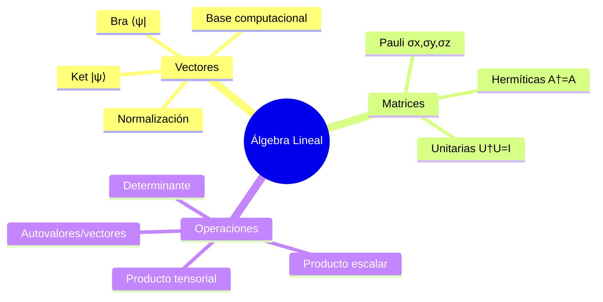
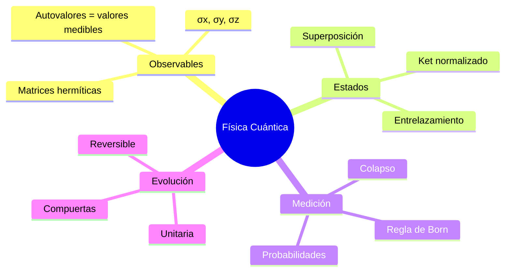

# Resumen Clase 4 - Introducción a la Computación Cuántica

**Fecha**: Clase 4  
**Docente**: Dr. Holik  
**Tema Principal**: Autovalores, Autovectores, Producto Escalar, Producto Tensorial y Compuertas Cuánticas

---

## Observaciones Generales

**[¶1]** Los primeros 28 minutos fueron un tutorial sobre Jupyter Notebooks y Python (Leandro Batlle, Fundación Sadosky), enfocado en instalación de Anaconda y entornos virtuales. Este contenido no es específicamente sobre computación cuántica.

## 1. Observables y Autovalores (00:28:00 - 01:00:00)

**[¶2]** Un **observable cuántico** representa una magnitud física medible (energía, spin, momento angular) y se representa matemáticamente como una **matriz hermítica** A tal que:

$$A = A^\dagger$$

donde $A^\dagger$ significa transpuesta conjugada.

**[¶3]** **Autovalores y Autovectores**:
- Un vector $|b\rangle \neq 0$ es **autovector** de A con **autovalor** λ si:
  $$A|b\rangle = \lambda|b\rangle$$
  
**[¶4]** Los únicos valores que puede tomar un observable al ser medido son sus autovalores.

**[¶5]** Para calcular autovalores:
1. Resolver: $\det(A - \lambda I) = 0$
2. Los λ que satisfacen esta ecuación son los autovalores

**[¶6]** Ejemplo: Matriz de Pauli σₓ
$$\sigma_x = \begin{pmatrix} 0 & 1 \\ 1 & 0 \end{pmatrix}$$

Autovalores: λ = ±1  
Autovectores: 
- $|+\rangle = \frac{1}{\sqrt{2}}(|0\rangle + |1\rangle)$ para λ = +1
- $|-\rangle = \frac{1}{\sqrt{2}}(|0\rangle - |1\rangle)$ para λ = -1

## 2. Notación de Dirac (Bra-Ket)

**[¶7]** Elementos fundamentales:
- **Ket**: $|\psi\rangle = \begin{pmatrix} \alpha_1 \\ \alpha_2 \end{pmatrix}$ (vector columna)
- **Bra**: $\langle\psi| = (\alpha_1^*, \alpha_2^*)$ (vector fila conjugado)
- **Bracket**: $\langle\phi|\psi\rangle$ = producto escalar

## 3. Producto Escalar

**[¶8]** Para vectores $|\psi\rangle$ y $|\phi\rangle$ en $\mathbb{C}^n$:

$$\langle\phi|\psi\rangle = \sum_{i=1}^n \alpha_i^* \beta_i$$

donde $|\psi\rangle = (\alpha_1, ..., \alpha_n)^T$ y $|\phi\rangle = (\beta_1, ..., \beta_n)^T$

**[¶9]** El producto escalar está relacionado con el ángulo entre vectores y con probabilidades de transición.

## 4. Regla de Born

**[¶10]** La **probabilidad de transición** entre estados $|\psi\rangle$ y $|\phi\rangle$ es:

$$P(\psi \to \phi) = |\langle\phi|\psi\rangle|^2$$

**[¶11]** $\langle\phi|\psi\rangle$ se denomina **amplitud de probabilidad** (número complejo).

**[¶12]** El **valor medio** de un observable A en el estado $|\psi\rangle$ es:

$$\langle A \rangle = \langle\psi|A|\psi\rangle$$

## 5. Producto Tensorial

**[¶13]** Para sistemas compuestos, si:
- Sistema 1: $|\psi\rangle = \begin{pmatrix} \alpha \\ \beta \end{pmatrix}$
- Sistema 2: $|\psi'\rangle = \begin{pmatrix} \alpha' \\ \beta' \end{pmatrix}$

El estado conjunto es:

$$|\psi\rangle \otimes |\psi'\rangle = \begin{pmatrix} \alpha\alpha' \\ \alpha\beta' \\ \beta\alpha' \\ \beta\beta' \end{pmatrix}$$

**[¶14]** Notación simplificada: $|0\rangle \otimes |1\rangle = |01\rangle$

**[¶15]** Para n qubits, la **dimensión del espacio** es $2^n$.

## 6. Base Computacional

**[¶16]** Para 2 qubits:
$$\mathcal{B}_2 = \{|00\rangle, |01\rangle, |10\rangle, |11\rangle\}$$

**[¶17]** Cálculo explícito:
- $|00\rangle = (1,0,0,0)^T$
- $|01\rangle = (0,1,0,0)^T$
- $|10\rangle = (0,0,1,0)^T$
- $|11\rangle = (0,0,0,1)^T$

## 7. Compuertas Cuánticas Básicas

**[¶18]** **Hadamard (H)**:
$$H = \frac{1}{\sqrt{2}}\begin{pmatrix} 1 & 1 \\ 1 & -1 \end{pmatrix}$$

Propiedades:
- $H|0\rangle = |+\rangle$
- $H|1\rangle = |-\rangle$
- $H^2 = I$ (es su propia inversa)

**[¶19]** **Pauli X (NOT cuántico)**:
$$X = \begin{pmatrix} 0 & 1 \\ 1 & 0 \end{pmatrix}$$
- $X|0\rangle = |1\rangle$
- $X|1\rangle = |0\rangle$

**[¶20]** **Pauli Y**:
$$Y = \begin{pmatrix} 0 & -i \\ i & 0 \end{pmatrix}$$

**[¶21]** **Pauli Z**:
$$Z = \begin{pmatrix} 1 & 0 \\ 0 & -1 \end{pmatrix}$$

## 8. Compuertas de Dos Qubits

**[¶22]** **CNOT (Control-NOT)**:

Representación matricial en $\mathbb{C}^{4 \times 4}$.

Tabla de verdad:
- $|00\rangle \to |00\rangle$
- $|01\rangle \to |01\rangle$
- $|10\rangle \to |11\rangle$
- $|11\rangle \to |10\rangle$

El primer qubit es **control**, el segundo es **target**.

**[¶23]** **SWAP**:
Intercambia los estados de dos qubits:
- $SWAP|01\rangle = |10\rangle$
- $SWAP|10\rangle = |01\rangle$

## 9. Compuertas de Tres Qubits

**[¶24]** **Toffoli (CCNOT)**:
Control doble NOT. Opera en $\mathbb{C}^8$.
- Si los dos primeros qubits están en $|1\rangle$, niega el tercero
- En caso contrario, no hace nada

Se puede expresar como:
$$|a,b,c\rangle \to |a,b,c \oplus (a \cdot b)\rangle$$

donde $\oplus$ es suma módulo 2 y $\cdot$ es producto.

## 10. Entrelazamiento Cuántico

**[¶25]** Un estado está **entrelazado** si NO se puede escribir como producto tensorial:

Ejemplo de estado entrelazado (Bell state):
$$|\Phi^+\rangle = \frac{1}{\sqrt{2}}(|00\rangle + |11\rangle)$$

**[¶26]** Este estado NO es separable, no existe descomposición:
$$|\Phi^+\rangle \neq |\psi_1\rangle \otimes |\psi_2\rangle$$

**[¶27]** Circuito para generar $|\Phi^+\rangle$:
```
|0⟩ ──H──●──
         │
|0⟩ ─────⊕──
```

Donde H = Hadamard, ● = control, ⊕ = target del CNOT.

**[¶28]** Otros estados de Bell:
- $|\Phi^-\rangle = \frac{1}{\sqrt{2}}(|00\rangle - |11\rangle)$
- $|\Psi^+\rangle = \frac{1}{\sqrt{2}}(|01\rangle + |10\rangle)$
- $|\Psi^-\rangle = \frac{1}{\sqrt{2}}(|01\rangle - |10\rangle)$ ← singlete

## 11. Circuitos Cuánticos

**[¶29]** Estructura general:
1. **Inicialización**: Preparar qubits en estado $|0\rangle$
2. **Compuertas**: Aplicar secuencia de operaciones unitarias
3. **Medición**: Medir en base computacional (típicamente σ_z)

**[¶30]** Ejemplo - superposición equiprobable de 2 qubits:
```
|0⟩ ──H──
         
|0⟩ ──H──
```
Resultado: $\frac{1}{2}(|00\rangle + |01\rangle + |10\rangle + |11\rangle)$

## 12. Conceptos Importantes Sobre Medición

**[¶31]** Medir en **base computacional** = medir el observable σ_z en cada qubit.

**[¶32]** Convenciones:
- Resultado "0" → autovalor +1 de σ_z
- Resultado "1" → autovalor -1 de σ_z

(Puede variar según la convención usada)

## 13. Matrices Unitarias

**[¶33]** Una matriz U es **unitaria** si:
$$U^\dagger U = UU^\dagger = I$$

donde $U^{-1} = U^\dagger$

**[¶34]** Las compuertas lógicas cuánticas son matrices unitarias.

**[¶35]** La **evolución temporal** de un sistema cuántico es unitaria:
$$|\psi(t)\rangle = U(t)|\psi(0)\rangle$$

---

## Mapas Mentales

### Álgebra Lineal para Computación Cuántica



### Física Cuántica Fundamental



### Computación Cuántica

```mermaid
mindmap
  root((Comp. Cuántica))
    Qubits
      Estado |ψ⟩
      Base {|0⟩,|1⟩}
      Superposición
      n qubits → 2^n dimensión
    Compuertas 1-qubit
      Hadamard
      Pauli X,Y,Z
      Rotaciones
    Compuertas 2-qubits
      CNOT
      SWAP
      Entrelazan
    Compuertas 3-qubits
      Toffoli
      Fredkin
    Circuitos
      Inicialización
      Secuencia de compuertas
      Medición final
```

---

## Referencias Cruzadas a Clases Anteriores

**[¶36]** **Conexión con [[ICC25-Holik-Clase1-Resumen]]**:
- Experimento de Stern-Gerlach (spin)
- Definición de qubit
- Diferencia entre bits clásicos y qubits

**[¶37]** **Conexión con [[ICC25-Holik-Clase2-Resumen]]**:
- Espacios vectoriales complejos
- Principio de superposición
- Notación de Dirac

**[¶38]** **Conexión con [[ICC25-Holik-Clase3-Resumen]]**:
- Evolución temporal unitaria
- Matrices de Pauli
- Reversibilidad

---

## Referencias a Bibliografía

**[¶39]** Los siguientes temas se encuentran desarrollados en detalle en la carpeta `_Bibliografia`:

1. **Nielsen & Chuang** - "Quantum Computation and Quantum Information":
   - Capítulo 2: Álgebra lineal para computación cuántica
   - Producto tensorial y sistemas compuestos
   - Compuertas cuánticas básicas

2. **Daniel Sánchez** (mencionado en clase):
   - Autovalores y autovectores
   - Producto escalar
   - Ejercicios de práctica

3. **Jeffrey Bub** (artículo en Diccionario Austral):
   - Entrelazamiento cuántico (conceptual)

**[¶40]** **Material adicional mencionado**:
- Paper en Nature: "Lógica cuántica de tres qubits usando moduladores de luz espaciales"
- Lógica cuántica de Birkhoff y von Neumann (no parte del curso, solo mención)

---

## Ejercicios Para Casa (Mencionados en Clase)

**[¶41]** 1. Calcular autovalores y autovectores de σ_y
**[¶42]** 2. Verificar que $H^2 = I$ (Hadamard es autoinversa)
**[¶43]** 3. Calcular tabla de verdad completa de CNOT
**[¶44]** 4. Expresar $|0\rangle$ y $|1\rangle$ en base {$|+\rangle, |-\rangle$}
**[¶45]** 5. Probar que el estado de Bell $|\Phi^+\rangle$ no es separable
**[¶46]** 6. Calcular producto tensorial:  
   $(a_0|0\rangle + a_1|1\rangle) \otimes (b_0|0\rangle + b_1|1\rangle)$
**[¶47]** 7. Verificar las acciones de Toffoli en la base computacional de 3 qubits

---

## Notas Técnicas Importantes

**[¶48]** **Suma módulo 2**:
- $0 \oplus 0 = 0$
- $0 \oplus 1 = 1$
- $1 \oplus 0 = 1$
- $1 \oplus 1 = 0$ ← crucial para Toffoli

**[¶49]** **Producto de bits clásico**:
- $0 \cdot 0 = 0$
- $0 \cdot 1 = 0$
- $1 \cdot 0 = 0$
- $1 \cdot 1 = 1$

---

## Herramientas Computacionales (Próxima Clase)

**[¶50]** Se mencionó que se trabajará con:
- **Qiskit** (IBM)
- **Amazon Braket**
- Python con Jupyter Notebooks

**[¶51]** Recomendación: Crear entornos virtuales separados para cada framework.

---

## Observaciones Pedagógicas del Docente

**[¶52]** El Dr. Holik enfatizó múltiples veces:
- Repetir cálculos en lápiz y papel
- Leer el libro de Nielsen & Chuang línea por línea
- Ver los videos grabados varias veces
- No aflojar con el estudio para llegar preparados a algoritmos cuánticos

**[¶53]** "El saber no ocupa lugar" - Se incentivó a explorar diferentes entornos de desarrollo.

---

**Duración total**: ~2h 50min  
**Material complementario**: Video grabado disponible